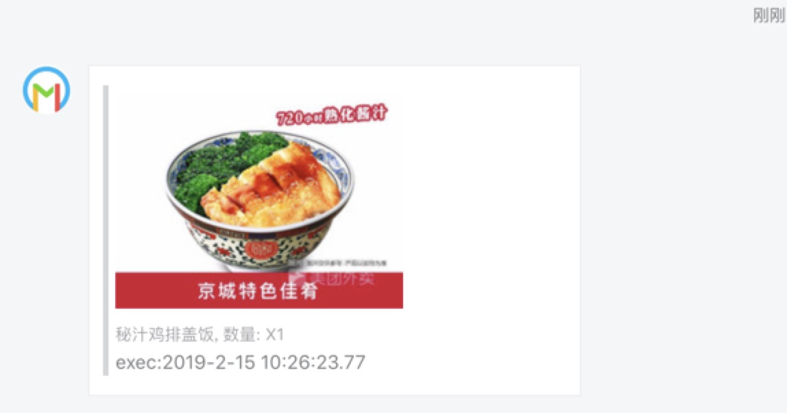
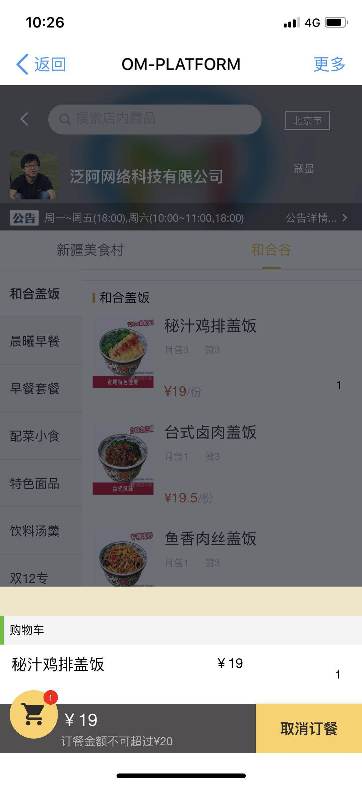
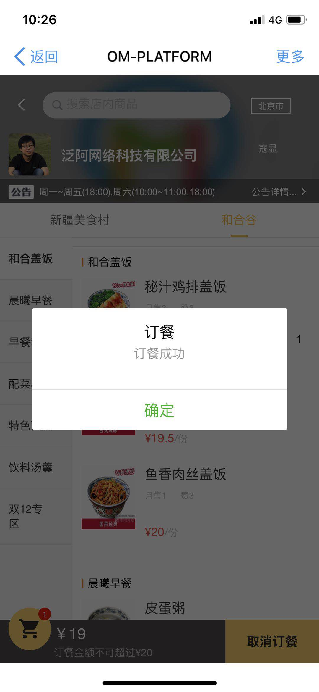
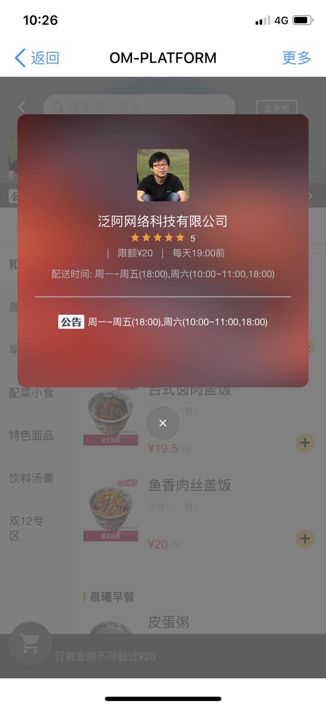
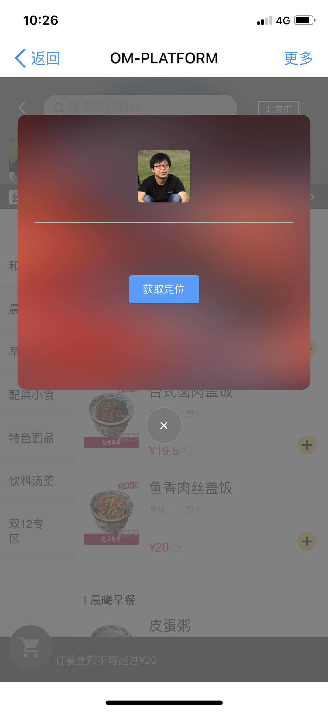
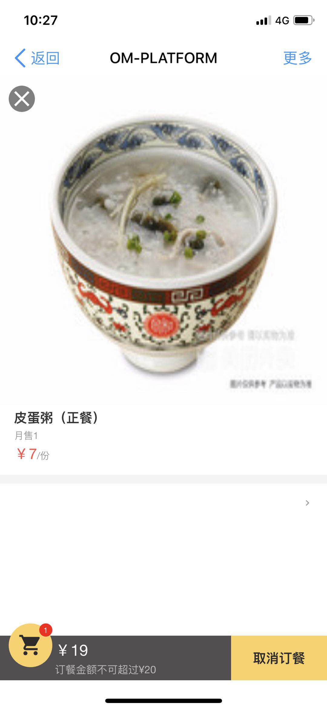
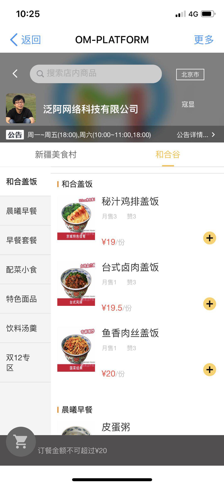

# nutz-dingtalk
### 1)创建数据库
```
create database dingtalk_meal charset utf8;
```
### 2)构建前端

```
cd nutz-dingtalk/ui/src/main/resources

npm install

npm run dev

npm run build

```

### 3)钉钉后台申请
登陆 https://open-dev.dingtalk.com/#/loginAndShareApp

申请-扫码登录应用授权应用

记录下 appId、appSecret、回调域名(例如:http://dingtalk.rekoe.com/oauth/dingding/callback	) 域名配置自己的

### 4)创建微应用
登陆获取方式:[地址](https://open-dev.dingtalk.com/#/loginAndShareApp)

微应用-微应用管理-创建微应用

方式选择:企业内部自主开发

配置好应用首页地址：http://dingtalk.rekoe.com/#/goods/1(域名填写自己的)

提交完后记录下 AgentID值

### 4)修改nutz-dingtalk/rest/src/main/resources/application.properties

修改数据库密码
修改ngrok的token(token获取可以登陆nutz.cn,用户中心)

### 钉钉扫码登陆
dingtalk.oauth.appid=xxx(步骤3中获取)

dingtalk.oauth.appsecret=xxx(步骤3中获取)

### 钉钉内部应用

dingtalk.agentid=xxx(步骤4中获取)

dingtalk.corpid=xxx([查看地址](https://open-dev.dingtalk.com/#/index))

dingtalk.corpsecret=xxx([开发着账号获取链接](https://open-dev.dingtalk.com/#/corpAuthInfo) 开发信息-开发者账号)

### 5)配置构建地址
```
打开文件 nutz-dingtalk/ui/src/main/resources/config/index.js
```

修改第三行

var buildpath = '../dist'

修改为 

```
var buildpath = '~/git/nutz-dingtalk/rest/src/main/resources/static/'
```

或者直接把构建完的dist目录copy到 `` nutz-dingtalk/rest/src/main/resources/static/``

启动运行 登陆到钉钉入口查看效果

默认登陆是钉钉扫码,可以切换账号登陆

默认账号admin 密码:12345678

后台商家管理可以通过采集美团外卖的数据

测试地址(因美团做了Cookie 验证 所以首次会跳转到引导页,可以忽略 按照提示多提交几次,采集成功)

http://waimai.meituan.com/restaurant/144689920684303686

## 演示













